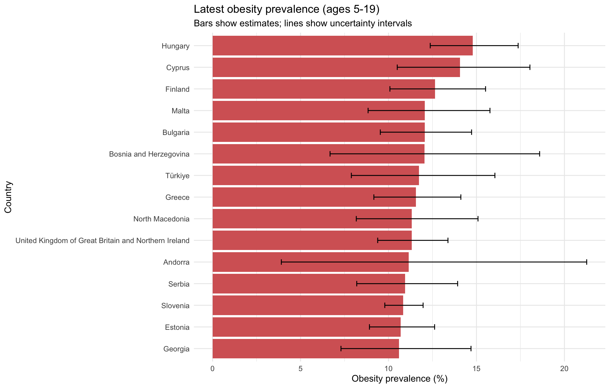

# Childhood Obesity and Health Inequalities in Europe

## Public-health question

Which countries in the WHO European Region show the highest obesity prevalence among children and adolescents, and how do patterns differ by age and sex?

## Data

The repository includes `data/raw/childhood_obesity.csv`, downloaded from the WHO indicator [Prevalence of obesity among children and adolescents aged 5–19 years](https://data.who.int/indicators/i/C6262EC/EF93DDB) and filtered to the WHO European Region. The source is licensed CC BY 4.0. Fields are:

`Country, Country_code, Year, Sex, Age_group, Obesity_prevalence, Lower_CI, Upper_CI, Source`

## Analysis

- Cleans country, demographic and prevalence fields.
- Summarises obesity prevalence by country, age group and sex.
- Identifies high-burden countries using quartiles.
- Exports `data/processed/tableau_childhood_obesity.csv` for Tableau.

## Run

```r
install.packages(c("dplyr", "ggplot2", "knitr", "rmarkdown", "tidyr"))
```

Open `childhood-obesity-analysis.Rmd` in RStudio and click **Knit**. The analysis reads the included WHO CSV and recreates the Tableau export and chart.

## Example visual



## Tableau dashboard

Create a country map, obesity ranking, sex comparison, trend chart and confidence-interval view.

## Methods and limitations

These values are modelled population estimates based on measured height and weight. Confidence intervals should be shown, and differences in underlying surveys and data availability should be considered when comparing countries.
